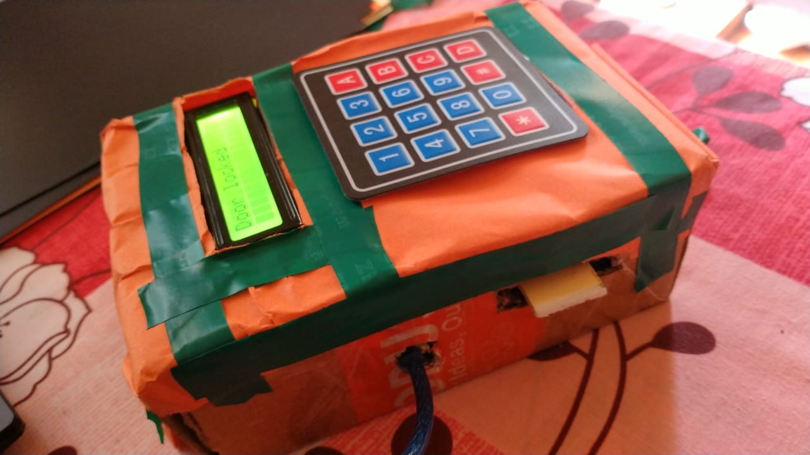

# Door Locked System with Bluetooth and Keypad

The Door Locked System with Bluetooth and Keypad, utilizing the 8051 microcontroller, is a project aimed at enhancing security and convenience in door access control. This project combines the capabilities of Bluetooth technology and a physical keypad to create a robust and user-friendly door lock system.

## Overview

The project focuses on integrating various components, including the AT89S52 microcontroller, LCD 16x2, keypad 4x4, HC-05 Bluetooth module, servo motor, and buzzer. The microcontroller acts as the central control unit, managing communication between the different components and controlling the door lock mechanism.

## Features

- Secure door access control system
- Integration of Bluetooth technology for remote access
- Physical keypad for manual entry
- LCD display for user feedback
- Servo motor for locking and unlocking the door
- Buzzer for audio feedback

## Installation

1. Connect the components as per the circuit diagram provided.
2. Upload the microcontroller code to the AT89S52 microcontroller.
3. Install the mobile application for Bluetooth communication (if applicable).
4. Mount the system onto the door securely.

## Usage

1. Enter the correct passcode on the keypad or use the mobile app to send a Bluetooth signal.
2. Upon successful authentication, the servo motor will unlock the door, and the LCD will display a confirmation message.
3. If the wrong passcode is entered, or authentication fails, the buzzer will sound, and the LCD will display an error message. 
